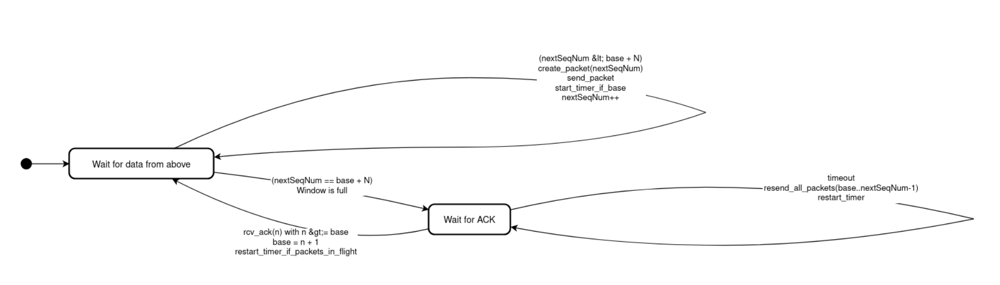

# Документ по Проектированию: Протокол RDTP (Reliable Data Transfer Protocol)

## 1. Введение

Данный документ описывает архитектуру и алгоритмы, используемые для реализации протокола надежной передачи данных (RDTP) поверх ненадежного транспортного протокола UDP. Цель RDTP — обеспечить гарантированную, упорядоченную и безошибочную доставку потока данных (файла) от отправителя (Sender) к получателю (Receiver) в условиях, когда нижележащий канал может терять, повреждать или переупорядочивать пакеты.

## 2. Формат Пакетов

Для RDTP определен единый, фиксированный формат заголовка пакета, который используется как для передачи данных, так и для отправки подтверждений (ACK). Использование единой структуры упрощает сериализацию, десериализацию и обработку.

Пакет состоит из 12-байтного заголовка и поля данных размером до 1024 байт.

#### 2.1. Структура пакета

```
 0                   1                   2                   3
 0 1 2 3 4 5 6 7 8 9 0 1 2 3 4 5 6 7 8 9 0 1 2 3 4 5 6 7 8 9 0 1
+-+-+-+-+-+-+-+-+-+-+-+-+-+-+-+-+-+-+-+-+-+-+-+-+-+-+-+-+-+-+-+-+
|                        Sequence Number                        |
+-+-+-+-+-+-+-+-+-+-+-+-+-+-+-+-+-+-+-+-+-+-+-+-+-+-+-+-+-+-+-+-+
|                     Acknowledgment Number                     |
+-+-+-+-+-+-+-+-+-+-+-+-+-+-+-+-+-+-+-+-+-+-+-+-+-+-+-+-+-+-+-+-+
|  Flags  |      Checksum       |            Length             |
+-+-+-+-+-+-+-+-+-+-+-+-+-+-+-+-+-+-+-+-+-+-+-+-+-+-+-+-+-+-+-+-+
|                                                               |
/                            Payload                            /
/                                                               /
|                                                               |
+-+-+-+-+-+-+-+-+-+-+-+-+-+-+-+-+-+-+-+-+-+-+-+-+-+-+-+-+-+-+-+-+
```

| Поле      | Размер (байты) | Описание                                                                                                   |
| :-------- | :------------- | :--------------------------------------------------------------------------------------------------------- |
| `seqNum`  | 4              | 32-битный порядковый номер пакета. Для пакетов с данными это номер текущего пакета. Для FIN-пакета — номер, следующий за последним пакетом с данными. |
| `ackNum`  | 4              | 32-битный номер подтверждения. Используется в ACK-пакетах для указания порядкового номера **ожидаемого** пакета. В GBN это кумулятивное подтверждение. |
| `Flags`   | 1              | 8-битное поле флагов для управления сессией: <br> • **ACK (0x01):** Указывает, что пакет является подтверждением. <br> • **FIN (0x02):** Указывает на завершение передачи данных. |
| `Checksum`| 2              | 16-битная контрольная сумма (Internet Checksum) для проверки целостности **всего пакета** (заголовок + данные). Вычисляется по алгоритму RFC 1071. |
| `Length`  | 2              | 16-битный размер полезной нагрузки (`Payload`) в байтах. Для ACK-пакетов `length` равен 0. |
| `Payload` | 0-1024         | Полезная нагрузка (часть передаваемого файла). |

**Важно:** Все многобайтовые поля (`seqNum`, `ackNum`, `length`) передаются в **сетевом порядке байт (big-endian)** для обеспечения кросс-платформенной совместимости.

#### 2.2. Контрольная сумма

Для обнаружения ошибок, возникающих при передаче по ненадежному каналу, используется 16-битная контрольная сумма "ones' complement".

*   **При отправке:** Поле `checksum` обнуляется. Затем вычисляется сумма всех 16-битных слов пакета с циклическим переносом. Результат побитово инвертируется и записывается в поле `checksum`.
*   **При получении:** Вычисляется сумма всех 16-битных слов **полученного** пакета, включая поле `checksum`. Если пакет не поврежден, результат этой операции должен быть `0xFFFF`. Любое другое значение указывает на ошибку, и такой пакет отбрасывается.

## 3. Выбранный алгоритм: Go-Back-N (GBN)

Для обеспечения надежной доставки был выбран алгоритм Go-Back-N. Он представляет собой компромисс между простотой реализации и эффективностью использования канала, позволяя отправлять несколько пакетов, не дожидаясь подтверждения на каждый из них (конвейерная передача).

#### 3.1. Логика Отправителя (Sender)

Отправитель оперирует "скользящим окном" размером **N**, которое определяет максимальное количество неподтвержденных пакетов, одновременно находящихся в сети.

**Ключевые переменные:**
*   `base`: Порядковый номер самого старого, еще не подтвержденного пакета. Это начало окна.
*   `nextSeqNum`: Порядковый номер следующего нового пакета для отправки.
*   `N`: Размер окна.

**Конечный автомат Отправителя:**


**Описание состояний и переходов:**
1.  **"Wait for data from above" (Ожидание данных сверху):**
    *   **Условие:** Окно не заполнено (`nextSeqNum < base + N`).
    *   **Действие:** Отправитель читает данные из файла, создает пакет с номером `nextSeqNum`, отправляет его и инкрементирует `nextSeqNum`. Если это был первый пакет в окне (`nextSeqNum == base`), запускается таймер.
    *   **Переход:** Если окно заполняется, отправитель переходит в состояние ожидания ACK.

2.  **"Wait for ACK" (Ожидание подтверждения):**
    *   **Событие: Получен ACK №n (rcv_ack):**
        *   GBN использует **кумулятивные подтверждения**. ACK с номером `n` подтверждает получение всех пакетов до `n` включительно.
        *   Отправитель обновляет `base = n + 1`. Это "сдвигает" окно вправо, освобождая место для отправки новых пакетов.
        *   Таймер перезапускается, если в окне еще остались неподтвержденные пакеты.
    *   **Событие: Истек таймаут (timeout):**
        *   Отправитель предполагает, что пакет `base` и, возможно, все последующие пакеты были потеряны.
        *   **Действие "Go-Back-N":** Он **повторно отправляет все пакеты** в текущем окне, от `base` до `nextSeqNum - 1`.
        *   Таймер перезапускается.

#### 3.2. Логика Получателя (Receiver)

Логика получателя в GBN предельно проста, так как он не буферизует пакеты, пришедшие не по порядку.

**Ключевая переменная:**
*   `expectedSeqNum`: Порядковый номер пакета, который получатель ожидает в данный момент.

**Алгоритм Получателя:**
1.  Получатель находится в единственном состоянии — ожидании пакета с номером `expectedSeqNum`.
2.  **Событие: Принят пакет с корректной контрольной суммой и `seqNum == expectedSeqNum`:**
    *   **Действие:** Пакет является ожидаемым. Его данные извлекаются и записываются в файл.
    *   `expectedSeqNum` инкрементируется.
    *   Отправителю посылается ACK с номером `expectedSeqNum - 1` (т.е. номером только что полученного пакета).
3.  **Событие: Принят пакет в любом другом случае** (неверная контрольная сумма или `seqNum != expectedSeqNum`):
    *   **Действие:** Пакет **отбрасывается**.
    *   Чтобы помочь отправителю быстрее обнаружить потерю, получатель отправляет ACK с номером `expectedSeqNum - 1` (то есть подтверждение на последний успешно принятый пакет). Это дублирующее подтверждение является для отправителя сигналом, что что-то пошло не так (хотя в каноническом GBN отправитель может их игнорировать до таймаута).

#### 3.3. Завершение сессии
*   После отправки всех данных файла, отправитель посылает специальный пакет с флагом `FIN`.
*   Эта отправка также является надежной: отправитель ждет `ACK` на `FIN`-пакет и переотправляет его в случае таймаута.
*   Получатель, получив `FIN`, отправляет на него `ACK` и завершает свою работу, закрывая файл.