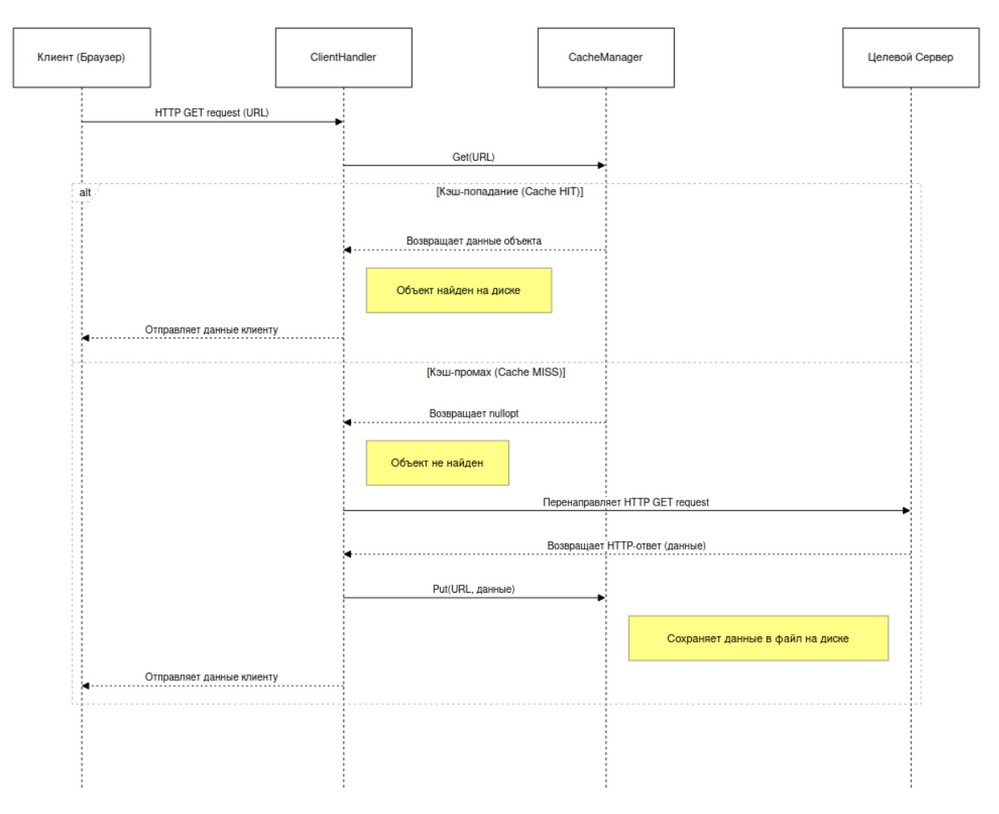

# Документ по Проектированию: Алгоритм Кэширования в Прокси-сервере

## 1. Введение

Данный документ описывает алгоритм и архитектурные решения, применяемые для кэширования HTTP-объектов в прокси-сервере. Цель кэширования — сократить время ответа для повторных запросов и снизить нагрузку на целевые веб-серверы и сеть в целом.

Реализация сосредоточена на простом, но эффективном **дисковом кэше**, который сохраняет полные HTTP-ответы на локальном диске.

## 2. Архитектура Модуля Кэширования

В соответствии с **Принципом единственной ответственности (Single Responsibility Principle)**, вся логика работы с кэшем инкапсулирована в отдельном классе `CacheManager`.

*   **`CacheManager`**: Этот класс предоставляет простой и абстрактный интерфейс для остальной части приложения (`ClientHandler`). Его задача — скрыть все детали, связанные с хранением, поиском и извлечением данных на файловой системе.

Интерфейс `CacheManager` состоит из трех ключевых методов:
*   `CacheManager(cache_dir)`: Конструктор, который принимает путь к директории кэша и инициализирует ее, если она не существует.
*   `Get(key)`: Пытается найти и вернуть объект из кэша по ключу.
*   `Put(key, data)`: Сохраняет объект в кэш.

Такое разделение позволяет в будущем легко заменить реализацию кэша (например, на in-memory кэш или базу данных), не изменяя высокоуровневую логику прокси-сервера.

## 3. Алгоритм Работы

Алгоритм кэширования интегрирован в жизненный цикл обработки одного HTTP-запроса в классе `ClientHandler`. Процесс можно описать следующей последовательностью шагов:

### 3.1. Шаг 1: Формирование ключа кэша

*   **Входные данные:** Полный URL из HTTP-запроса (например, `http://www.example.com/index.html`).
*   **Действие:** URL используется в качестве уникального **ключа кэша**. Это гарантирует, что запросы к разным URL будут кэшироваться как отдельные объекты.

### 3.2. Шаг 2: Проверка кэша (Cache Lookup)

*   `ClientHandler` вызывает `cacheManager->Get(url)`.
*   Внутри `CacheManager` происходит преобразование ключа (URL) в имя файла. Простое сохранение файлов с URL в качестве имени невозможно из-за недопустимых символов (`/`, `:`, `?`).
*   **Алгоритм именования файлов:**
    1.  Ключ (URL) хэшируется с использованием криптографической функции **SHA-256**. Это дает несколько преимуществ:
        *   **Фиксированная длина:** Результат хэширования всегда имеет одинаковую длину (64 символа в hex-представлении), независимо от длины URL.
        *   **Уникальность:** Вероятность коллизий (когда два разных URL дают один и тот же хэш) пренебрежимо мала.
        *   **Безопасность символов:** Хэш состоит из символов `[0-9a-f]`, которые безопасны для использования в именах файлов в любой операционной системе.
    2.  Полученный хэш используется как имя файла в директории кэша (например, `cache/d4a1d82e...c4a2a1.cache`).
*   `CacheManager` проверяет наличие файла с таким именем.

### 3.3. Шаг 3: Обработка результата

*   **Кэш-попадание (Cache HIT):**
    *   Если файл найден, `CacheManager` читает его содержимое целиком в бинарный буфер (`std::vector<char>`) и возвращает его.
    *   `ClientHandler` получает эти данные и немедленно отправляет их клиенту.
    *   **Соединение с целевым сервером не устанавливается.** Это основной выигрыш в производительности.
    *   В лог выводится сообщение `Cache HIT`.

*   **Кэш-промах (Cache MISS):**
    *   Если файл не найден, `CacheManager` возвращает пустой результат (`std::nullopt`).
    *   `ClientHandler` понимает, что объекта в кэше нет, и выполняет следующие действия:
        1.  Устанавливает TCP-соединение с целевым сервером, извлеченным из URL.
        2.  Перенаправляет HTTP-запрос.
        3.  Получает полный ответ от целевого сервера и сохраняет его в буфер.
        4.  **Сохранение в кэш:** Вызывает `cacheManager->Put(url, response_data)`, чтобы сохранить полученный ответ для будущих запросов. `CacheManager` создает новый файл с хэш-именем и записывает в него данные.
        5.  Отправляет полученный ответ клиенту.
    *   В лог выводится сообщение `Cache MISS`.