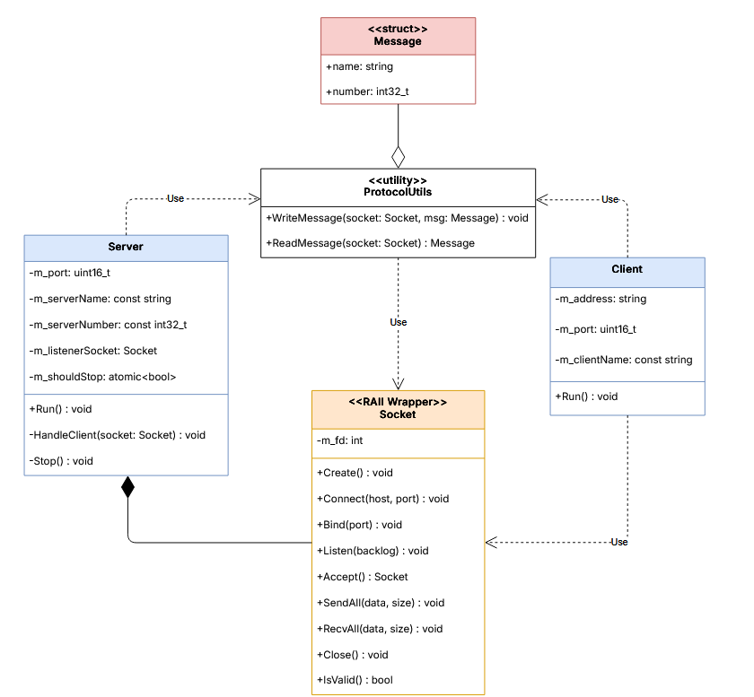
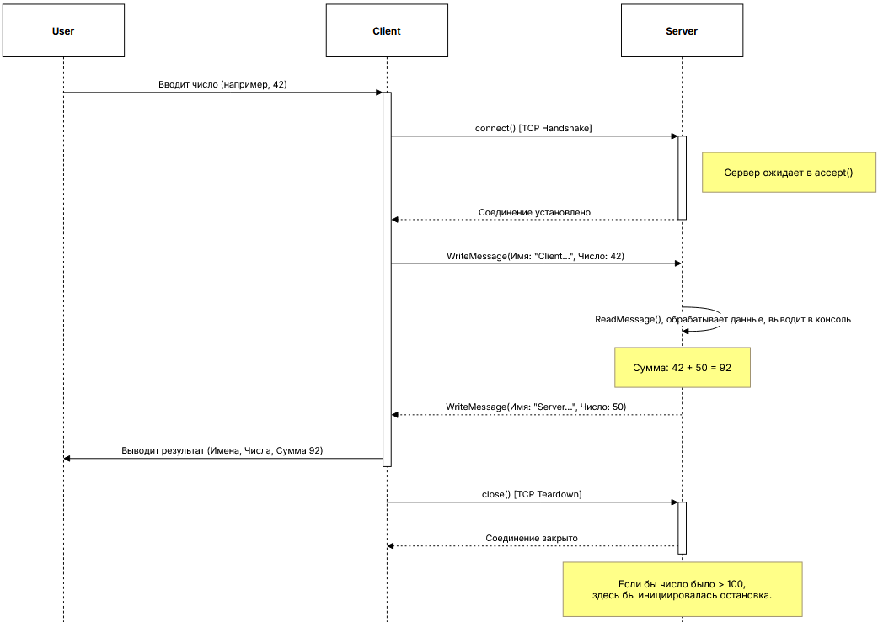

## Документ по Проектированию: Клиент-Серверное Приложение net-app

### 1. Обзор Архитектуры

Архитектура решения построена на трех основных компонентах: **Клиентское приложение**, **Серверное приложение** и **общая библиотека**, которая инкапсулирует переиспользуемую логику.

### 2. Компоненты Системы

#### 2.1. Общий модуль (`src/Common`)

Это ядро переиспользуемого кода.

*   **`Socket.h / Socket.cpp`**
    *   **Назначение:** Предоставляет объектно-ориентированную, RAII-совместимую обертку над низкоуровневыми POSIX-сокетами (`int fd`).
    *   **Ответственность:**
        *   Управление жизненным циклом сокета: создание (`socket()`) и автоматическое закрытие (`close()`) в деструкторе. Это предотвращает утечки ресурсов.
        *   Инкапсуляция системных вызовов: `connect`, `bind`, `listen`, `accept`.
        *   Обеспечение надежной передачи данных через методы `SendAll` и `RecvAll`, которые гарантируют отправку/получение всего буфера данных.

*   **`Protocol.h`**
    *   **Назначение:** Определяет структуру и правила обмена данными между клиентом и сервером.
    *   **Ответственность:**
        *   Определение структуры сообщения `Protocol::Message`.
        *   Реализация функций `WriteMessage` (сериализация) и `ReadMessage` (десериализация) для преобразования структуры `Message` в поток байт и обратно.

#### 2.2. Сервер (`src/Server`)

*   **Назначение:** Принимать и обрабатывать подключения от клиентов в многопоточном режиме.
*   **Архитектура:**
    *   **Главный поток:** Создает слушающий сокет (`m_listenerSocket`), привязывает его к порту и входит в бесконечный цикл ожидания `accept()`.
    *   **Рабочие потоки:** При успешном `accept()`, главный поток создает новый `std::jthread` и передает ему владение клиентским сокетом. Этот поток выполняет всю логику обработки одного клиента в функции `HandleClient` и завершается после закрытия соединения.
*   **Механизм остановки:**
    *   Используется `std::atomic<bool> m_shouldStop`.
    *   Когда поток-обработчик получает от клиента число вне диапазона [1, 100], он вызывает метод `Stop()`.
    *   `Stop()` устанавливает флаг `m_shouldStop = true` и принудительно закрывает слушающий сокет `m_listenerSocket.Close()`. Это приводит к тому, что блокирующий вызов `accept()` в главном потоке немедленно завершается с ошибкой, позволяя главному циклу корректно завершиться.

#### 2.3. Клиент (`src/Client`)

*   **Назначение:** Выполнить одну сессию "запрос-ответ" с сервером.
*   **Архитектура:**
    *   Простое линейное выполнение.
    *   Запрашивает данные у пользователя.
    *   Создает сокет и подключается к серверу.
    *   Отправляет одно сообщение и ожидает одного ответа.
    *   Выводит результат в консоль и завершает работу. Сокет автоматически закрывается благодаря RAII.

### 3. Схема Взаимодействия (Sequence Diagram)

