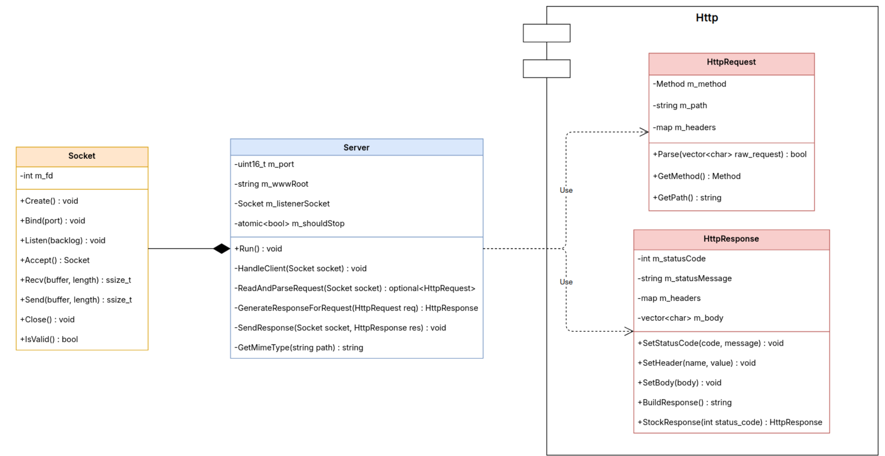
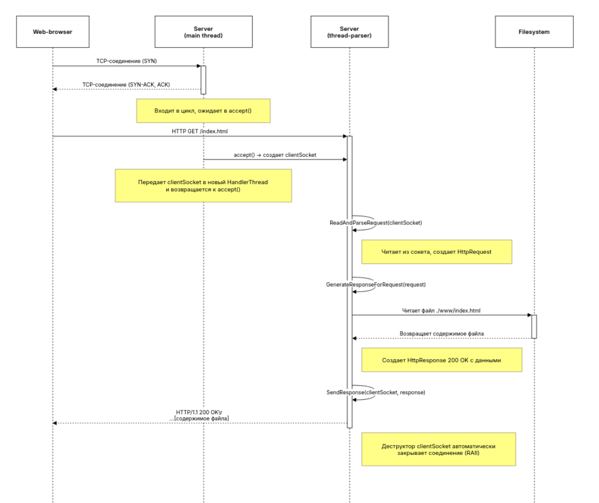

## Документ по Проектированию: HTTP Веб-сервер

### 1. Обзор Архитектуры

Архитектура системы четко разделена на три логических слоя, каждый из которых имеет свою зону ответственности. Такой подход минимизирует зависимости и способствует созданию модульной системы.

### 2. Компоненты Системы

#### 2.1. `Common::Socket`

*   **Назначение:** Полное и безопасное управление жизненным циклом системного сокета.
*   **Ответственность:** Класс `Socket` отвечает **только** за взаимодействие с POSIX Sockets API. Он не знает, какие данные по нему передаются (HTTP, FTP или что-то еще).

#### 2.2. `Http::HttpRequest` и `Http::HttpResponse`

*   **Назначение:** Моделирование протокола HTTP.
*   **`HttpRequest`:** Его **единственная ответственность** — разобрать массив символов (`std::vector<char>`) и извлечь из него метод, путь и заголовки.
*   **`HttpResponse`:** Его **единственная ответственность** — собрать ответ из кода состояния, заголовков и тела в единую строку, готовую к отправке.

#### 2.3. `Core::Server`

*   **Назначение:** Управлять жизненным циклом сервера и координировать обработку запросов.
*   **Многопоточность:** Принимая новое соединение, `Server` немедленно создает отдельный поток `std::jthread` для его обработки. Это позволяет главному потоку мгновенно вернуться к прослушиванию порта, обеспечивая высокую отзывчивость сервера.

### 3. Схема Взаимодействия (Sequence Diagram)

