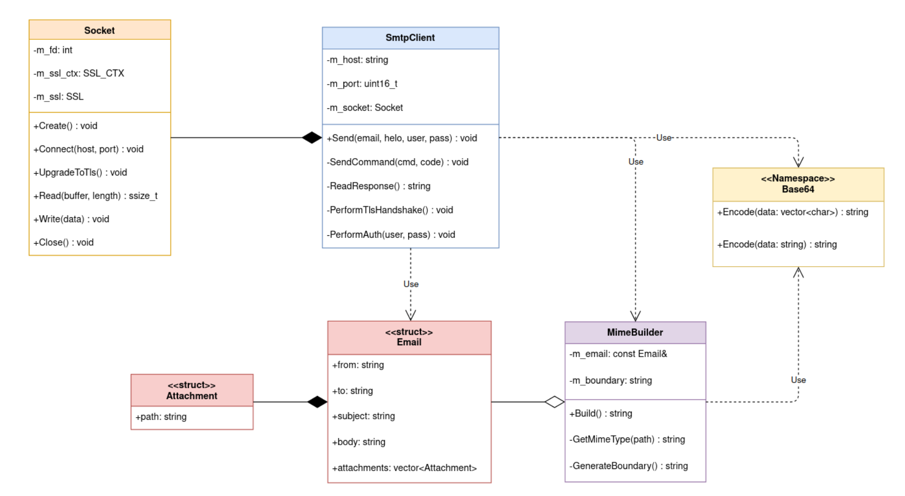
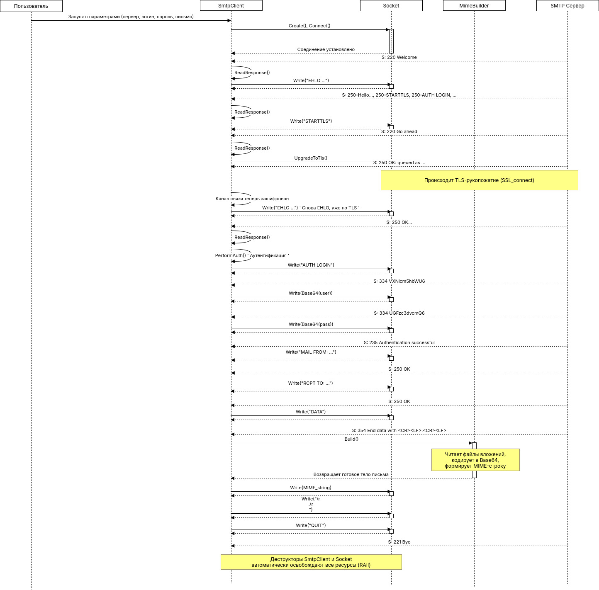

## Документ по Проектированию: SMTP-клиент с TLS и MIME

### 1. Обзор Архитектуры

Система спроектирована как многослойная архитектура, где каждый компонент имеет четко определенную зону ответственности. Это позволяет изолировать сложную логику (например, TLS и MIME) в независимые, тестируемые модули.

**Описание диаграммы:**
*   **`SmtpClient`** — это высокоуровневый "оркестратор", управляющий всей SMTP-сессией.
*   **Модуль MIME** (`MimeBuilder`) — это "фабрика", которая отвечает исключительно за сборку сложного MIME-сообщения. Он не знает о сети.
*   **Общий модуль** (`Socket`, `Base64`) — это низкоуровневый "инструментарий", предоставляющий базовые, переиспользуемые функции. `Socket` теперь инкапсулирует не только системные вызовы, но и всю сложность работы с OpenSSL.

### 2. Компоненты Системы (SOLID в действии)

#### 2.1. `Socket` — Инкапсуляция и SRP

*   **Ответственность:** Управление безопасным каналом связи.
*   **Принцип единственной ответственности (SRP):** Ответственность класса `Socket` была расширена, но осталась единой — **управление каналом связи**. С точки зрения `SmtpClient`, он все еще работает с "сокетом" через простые методы `Read()` и `Write()`. Вся сложность, связанная с `SSL_CTX`, `SSL`, TLS-рукопожатием и шифрованием/дешифрованием данных, **полностью инкапсулирована** внутри `Socket`.
*   **RAII:** Деструктор `~Socket()` теперь отвечает за корректное освобождение не только файлового дескриптора, но и всех структур OpenSSL (`SSL_free`, `SSL_CTX_free`), что критически важно для предотвращения утечек памяти.

#### 2.2. `MimeBuilder` — SRP и Принцип открытости/закрытости (OCP)

*   **Назначение:** Создание MIME-сообщений в соответствии со стандартами RFC.
*   **Принцип единственной ответственности (SRP):** Этот класс отвечает **только** за формирование MIME-строки. Он не занимается сетью или файловым вводом-выводом напрямую (хотя и читает файлы для кодирования). Он принимает структурированные данные (`Email`) и возвращает строку. Это делает его идеально тестируемым в изоляции.
*   **Принцип открытости/закрытости (OCP):** Класс открыт для расширения (например, можно легко добавить поддержку `multipart/alternative` для HTML-версий писем), но закрыт для модификации (существующая логика для `multipart/mixed` останется неизменной).

#### 2.3. `SmtpClient` — Оркестратор сессии

*   **Назначение:** Управление полным циклом SMTP-диалога.
*   **Ответственность:** `SmtpClient` является высокоуровневым компонентом, который использует низкоуровневые модули для выполнения своей задачи. Его логика точно следует протоколу SMTP:
    1.  Подключиться (используя `Socket`).
    2.  Обменяться `EHLO`.
    3.  Инициировать `STARTTLS` (делегируя шифрование `Socket::UpgradeToTls`).
    4.  Выполнить `AUTH LOGIN` (используя `Base64` для кодирования).
    5.  Подготовить тело письма (делегируя это `MimeBuilder::Build`).
    6.  Отправить письмо командами `MAIL FROM`, `RCPT TO`, `DATA`.
    7.  Завершить сессию.

### 3. Схема Взаимодействия (Sequence Diagram)

Эта диаграмма показывает полный, пошаговый процесс отправки письма с вложением.

