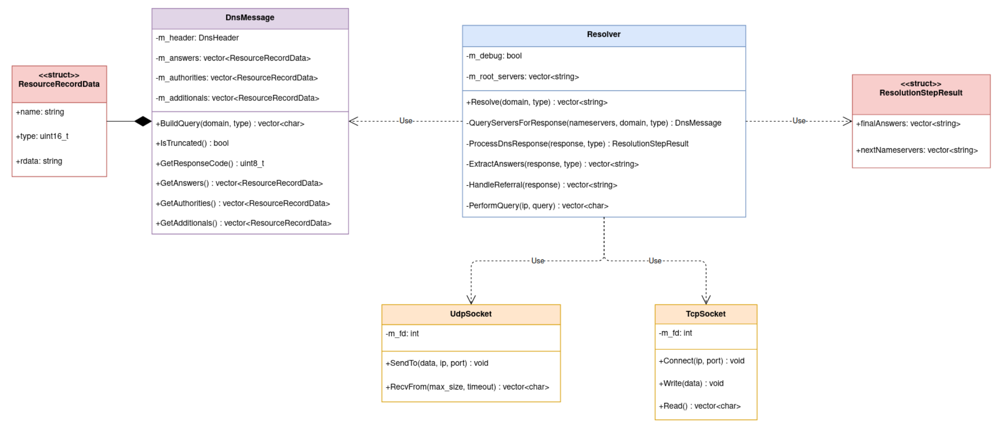

## Документ по Проектированию: Итеративный DNS-резолвер

### 1. Обзор Архитектуры

Система спроектирована по модульному принципу, четко разделяя ответственность между компонентами. Это позволяет изолировать сложную логику (например, парсинг бинарного протокола и сетевое взаимодействие) в независимые, легко поддерживаемые модули.

**Описание диаграммы:**
*   **`Resolver` (`Core`):** Это высокоуровневый "оркестратор", реализующий итеративный алгоритм. Он не знает деталей DNS-протокола или системных сокетов, а делегирует эту работу специализированным модулям.
*   **Модуль DNS (`Dns`):** Инкапсулирует всю сложность бинарного протокола DNS. Класс `DnsMessage` отвечает за создание запросов и парсинг ответов. Этот модуль — "переводчик" с языка байт на язык структурированных данных.
*   **Общий модуль (`Common`):** Предоставляет низкоуровневые утилиты для работы с сетью. Классы `UdpSocket` и `TcpSocket` являются безопасными RAII-обертками над системными сокетами.

### 2. Компоненты Системы (SOLID в действии)

#### 2.1. `DnsMessage` — Принцип единственной ответственности (SRP)

*   **Назначение:** Полная инкапсуляция логики DNS-протокола.
*   **Ответственность:** Этот класс отвечает **только** за преобразование данных:
    1.  Из структурированного запроса (`домен`, `тип`) -> в бинарный пакет (`std::vector<char>`).
    2.  Из бинарного пакета (`std::vector<char>`) -> в структурированный объект с доступом к заголовкам и записям.
*   Он ничего не знает о сети, сокетах или алгоритме разрешения. Это чистый "парсер-сериализатор", который можно тестировать в полной изоляции.

#### 2.2. `UdpSocket` и `TcpSocket` — SRP и Инкапсуляция

*   **Назначение:** Безопасное управление системными сокетами.
*   **Ответственность:** Каждый класс отвечает только за свой тип сокета. Они скрывают всю сложность системных вызовов (`socket`, `sendto`, `connect`, `read`, `write`), добавляют обработку ошибок (через исключения) и управление ресурсами (через RAII).
*   **Особенность `TcpSocket`:** Инкапсулирует логику чтения DNS-сообщения по TCP (сначала чтение 2 байт длины, затем — самого сообщения).

#### 2.3. `Resolver` — Оркестратор и SRP

*   **Назначение:** Реализация итеративного алгоритма разрешения DNS.
*   **Ответственность:** `Resolver` — это мозг операции. После рефакторинга его основной метод `Resolve` стал чистым циклом-оркестратором, который делегирует всю работу специализированным приватным методам:
    *   `QueryServersForResponse()`: Отвечает за опрос списка серверов.
    *   `ProcessDnsResponse()`: Отвечает за анализ ответа и принятие решения о следующем шаге.
    *   `ExtractAnswers()` и `HandleReferral()`: Еще более гранулярные методы, реализующие конкретные части анализа.
*   Эта декомпозиция делает код понятным, легко тестируемым и соответствующим Принципу единственной ответственности на уровне методов.

``